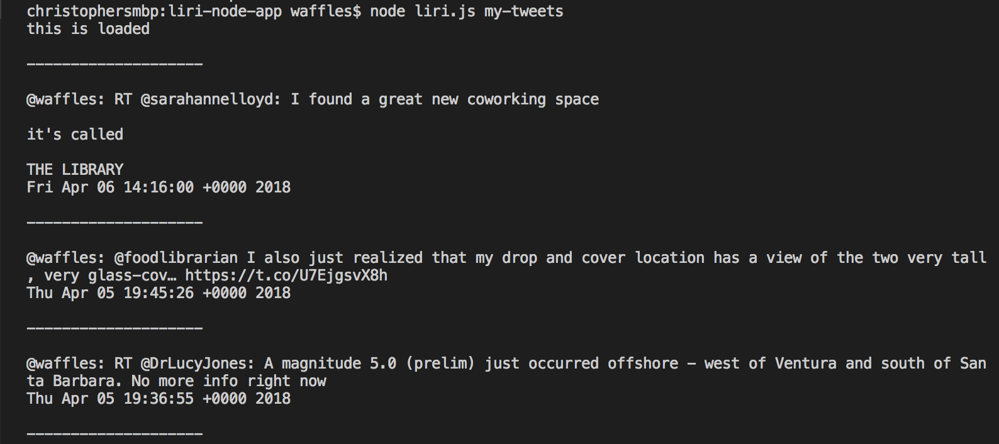
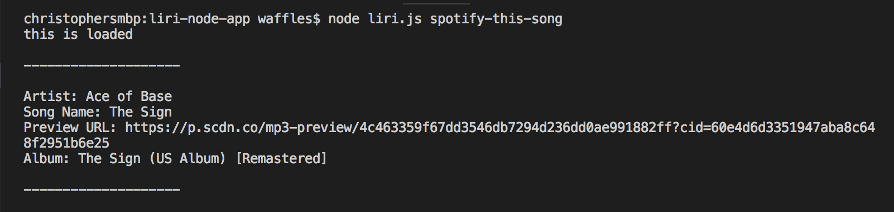
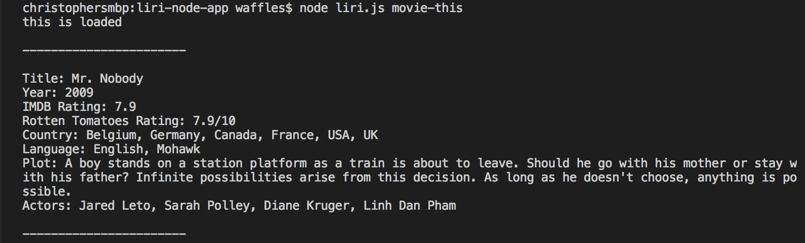
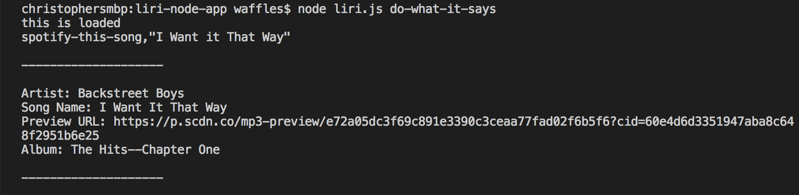

# liri-node-app

In this example, i made a LIRI. LIRI is like iPhone's SIRI. However, while SIRI is a Speech Interpretation and Recognition Interface, LIRI is a Language Interpretation and Recognition Interface. LIRI is a command line node app that takes in parameters and gives you back data.

Liri can do the following commands
****************************************
my-tweets: Displays the latest 20 tweets of the account its pointing to.

spotify-this-song: Can search spotify songs.

movie-this: Grab movie data from OMDB, defaulting to the movie Mr. Nobody if you dont make an entry.

do-what-it-says: It will search a default song through spotify documented through the random.txt file.

****************************************
